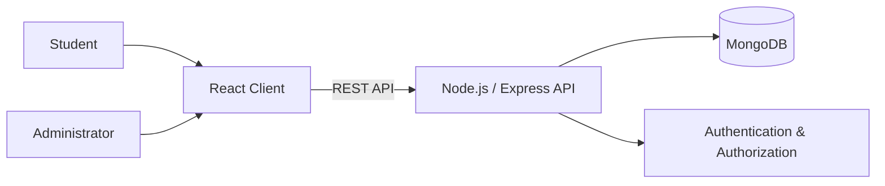
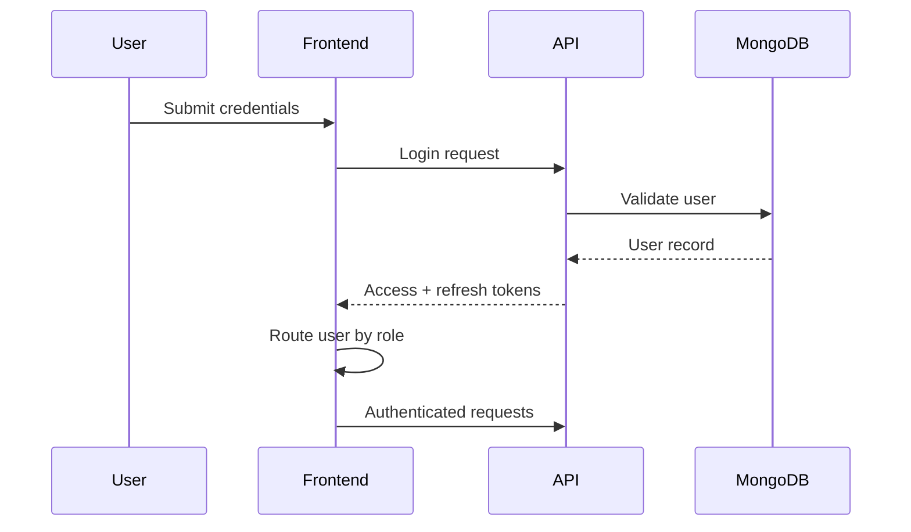

<div align="center">

# Student Portal

**Full-stack university management platform for students and administrators.**


</div>

---

## Overview

Student Portal is a full-stack academic management system with separate experiences for students and administrators.

Students can access their academic information, register for courses, review grades and schedules, and manage their profile. Administrators can manage students, courses, and grades through protected administration routes.

The application is split into independent frontend and backend services and includes Docker Compose configuration for running the full stack locally.

## Core Features

### Student Portal

- Student dashboard
- Profile management
- Course registration
- Grade viewing
- Academic schedule viewing
- Protected student routes

### Administration

- Admin dashboard
- Student management
- Course management
- Grade management
- Protected admin routes

### Backend Modules

- Authentication
- Users
- Courses
- Grades
- Schedules
- Announcements

## Architecture



The frontend communicates with an Express REST API, while MongoDB stores application data through Mongoose. Authentication uses JWT-based access and refresh tokens, with protected areas for student and admin roles.

## Tech Stack

| Layer | Technologies |
| --- | --- |
| **Frontend** | React 19, Vite, React Router, Tailwind CSS |
| **Forms & Validation** | React Hook Form, Zod |
| **HTTP Client** | Axios |
| **Backend** | Node.js, Express.js 5 |
| **Database** | MongoDB, Mongoose |
| **Authentication** | JWT, bcrypt |
| **Backend Validation** | Joi |
| **Infrastructure** | Docker, Docker Compose |

## Role-Based Routing

```text
/login

/student
├── dashboard
├── profile
├── schedule
├── grades
└── courses

/admin
├── dashboard
├── students
├── courses
└── grades
```

The frontend guards application routes based on the authenticated user's role before rendering student or administrator layouts.

## Project Structure

```text
student-portal/
├── backend/
│   ├── config/
│   ├── scripts/
│   └── src/
│       ├── DB/
│       ├── middleware/
│       ├── modules/
│       │   ├── Auth/
│       │   ├── Course/
│       │   ├── User/
│       │   ├── announcements/
│       │   ├── grades/
│       │   └── schedule/
│       └── utils/
│
├── frontend/
│   └── src/
│       ├── components/
│       ├── context/
│       ├── layouts/
│       ├── pages/
│       │   ├── admin/
│       │   └── student/
│       ├── protectedRoutes/
│       └── services/
│
└── docker-compose.yml
```

## Authentication Flow



## Running with Docker

The repository includes Docker configuration for the frontend, backend, and MongoDB database.

```bash
git clone https://github.com/Eyad20210197/student-portal.git
cd student-portal
docker compose up --build
```

Default local services:

| Service | Address |
| --- | --- |
| Frontend | `http://localhost:5173` |
| Backend API | `http://localhost:5000/api` |
| MongoDB | `mongodb://localhost:27017/studentportal` |

To stop the environment:

```bash
docker compose down
```

## Running Manually

### Backend

```bash
cd backend
npm install
npm run dev
```

### Frontend

```bash
cd frontend
npm install
npm run dev
```

Copy `backend/.env.example` into your local environment configuration before starting the backend outside Docker.

## Engineering Focus

This project demonstrates:

- frontend/backend separation
- role-based authentication and protected routes
- modular backend organization
- REST API integration
- academic management workflows
- form and request validation
- MongoDB data persistence
- containerized local development

---

<div align="center">

Developed by **[Eyad Aboelftoh](https://github.com/Eyad20210197)**

</div>
